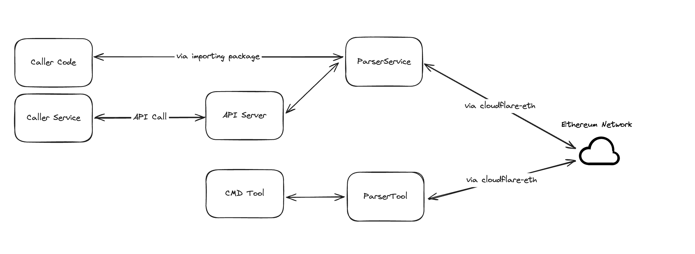

# Docs

This docs is used to record the specifications of `Simple Ethereum Parser`. The following topics are covered but not limited to:

1. The Requirements Analysis 
  * Functional Requirements 
  * Non-Functional Require
2. The Tech Designs 
  * Architecture
  * Key Designs
3. Tests
4. Deployment 
5. Runtime
6. TODOs 
7. Others

## The Requirements Analysis 

### Terminology
|Terminology|Explain|
|:-- | :-- |
| Parser | The ethereum parser which would be implemented in this project |
| Cmd tool | The command line tool which would be implemented in this project |
| API Server | The server would server the API requests, which would be implement in this project| 
| Callers | The entities (code, services .etc) which may involve the code of `Parse`, or call the API of the `API Server` |

### Functional Requirements 

According to the original requirements document, there are two parts of function requirements, the parser itself and the access part.
* The Parser which expose 3 APIs 
  There is nothing special to analyse for this part. We would implement this part via the `Ethereum JSON-RPC`, as the doc requires.

* The ways to access the Parser, which may cover **code**, **command line** and **REST API call**  
  * Access via code. **One package would be implemented**, and the caller code can access the parse via the exposed interfaces.
  * Access via command line. **A simple cmd tool would be implemented** directly, to support this requirement.
  * Access via API call. The APIs would be exposed to the callers, and an `API Server` would be implemented to serve the API call. 

### Non-Function API Requirements

* Performance

The QPS of API `parser.GetTransactions` is 200. To achieve this, there are some key problems need to pay attention for 3 different access ways.
  * Access via code. The caller need to pay attention to the performance. Some configurations is necessary to support this. See more details in the Tech Designs part.
  * Access vis command line. Since the cmd tool is called manually, the performance is not required so strictly. For example, it's tolerable of a little higher latency to get all the transactions of an address.
  * Access via API call. Performance is required to match the QPS.

* High Availability

For simplification, HA is not covered in the initial version of the project.  
  * Currently, we are storing data in memory, which leads the service instances stateful. To achieve the HA, we definitely need to consider data replication (hence data latency and consistency are coming afterward closely) 
  * In future, it's worth to store the data in other centralized storage component, which make the service stateless, which is more friendly to HA.

* Stability

  One potential risk of stability is the **memory usage**. It's possible to have a large number of addresses subscribed and some of them have a huge number of transactions. 

  Before the data is migrated to a robust separate storage component, it's necessary to to have some limitations on the number of subscribed addresses and the number of transactions of each address
  

* Scalability  

This point is NOT covered in this version. 

The services are stateful with in-memory data, hence a lot of work need to consider to scale up/down the service instances, for example, data sharding and migration need to consider when the service is scaled up or down. 

Actually, there would be ONLY 1 instance running in the initial version.

* Extendability 

The `parser` package is exposed as interface. It would be easy to extend different implementations, for example, an implementation which uses separated storage components. 
  
* Observability

For the first version, only logging is supported.  Its' better to have monitoring and tracing also, but that need more complex infrustructures.
    
## The Tech Designs 

### Terminology
|Terminology|Explain|
|:-- | :-- |
| ServiceParser| One implementation of `Parser` interface, which would serve the `API Server` and scenario of accessing via code |
| ToolParser | One implementation of `Parser` interface, which would serve the `Cmd Tool` |

### Architecture

The over all architecture(dependencies, data flows) would be like this

There would 2 implementations of `Parser` interface, which serve different scenarios. Refer to the key design sections for more details.

### Key Designs

#### ethereum.httpclient 

The `ServiceParser` would serve the `API Server` and scenarios of accessing via code.  

##### Function

* An `EthereumChainAccesser` interface is exposed for application services.
* Implement client based on `Ethereum JSON RPC` based on HTTP protocol.
* It uses the golang built-in `net/http` package
* It access the ethereum chain via entry point "https://cloudflare-eth.com/" (or local servers for testing)

#### parser.serviceParser

`serviceParser` is implemented to serve the scenarios of access via code or API call. That's means, it can run as a component of a API server or be imported by caller.

##### Function

* An `Parser` interface is exposed
* `parser.ServiceParser` implements the `Parser` interface.
* It depend on the `ethereum.EthereumChainAccessor` to interact with ethererum chain

##### Performance

To reduce the cost of accessing on-chain data, `parser.ServiceParser` would access ethereum chain asynchronously. For more details, there are several components co-working.

* The main thread. Serve the API call.
* The `Task Distributer`. Distribute the task to get new transaction when there is new block generated on chain.
* The `Task Execution Controller`. Control the task processing progress.
* The `Task Execution Workers`. Execute the task to get new transactions for addresses **concurrently**. The number of workers can be configured. 

##### Stability

Since the data is stored into memory for now, we need pay attention to the memory usage. To do this, we need to

* Make sure there is no memory leakage. (It's **Definitely**.)
* Limitation about the `max number of subcribed addresses` and `max number of transaction of one address` is involved. And such limitation is configured.
    * If the subscribed address number exceeds the limitation, FRU policy would be used to retired some addresses.
    * If the number of stored transactions of an address exceeds the limitation, the old ones would be retired (this actually depends on the order of the data return from chain entry point).

#### parser.toolParser

`toolParser` is used to server the command-line tool scenario. For this scenario, performance is required so much. So, it just calls the `ethereum.httpclient` to get the block number and transactions of an address

#### cmd/server

`cmd/server` works as an `API Server`. 

##### Function

* It implements the 3 required APIs, based on `json` format and HTTP protocol. 
* It depends on the `parser.serviceParser` to do the work

##### cmd/cmdtool

`cmd/cmdtool` is an simple command line tool, which support ad-hoc, manually scenarios to get block number and transactions. For this scenario, performance is not so sensitive.

##### Function

* It depends on the `parser.toolParser` to do the work

#### cmd/testserver

`cmd/testserver` works as an `API Server` for testing purpose.

* `Rate Limiting` is triggered when access the required entry point. So, a test service is necessary for unit tests and some of integration tests. 
* It serves API call via `Ethereum JSON RPC` format and HTTP protocol.
* It constructs some mock on chain data, the block number and transactions

#### logging.Logger

`logging` package provide the Obserability of the whole project.

* An interface named `Logger` is exposed to upstream. 
* `defaultLogger` is implemented based on `os.Std*`.
* `fileLogger` is simply implemented based on file.

### Tests

#### Approach

* Unit Tests
    * Unit Tests is implemented with each packages. 
    * `mockgen` paged is depended to mock the behavior of interface 
    * `cmd/testserver` is depended for tests. (Such cases are more like integration tests, actually)
* Integration Tests
    * `cmd/testserver` is depended for tests. 
    * `postman` is used to send API query
* Performance 
    * Skip for now because of tight timing.

#### Test Cases

TBA (Because of tight timing)

### Deployment

TBA (Because of tight timing)

### Runtime

TBA (Because of tight timing)

### TODOs
| Module / Function | Todo Items | Comments |
|:---| :--- | :-- |
| logging | * Add file partition | |
| ethereum.httpclient | * Refactor the API implementations ||
| parser.serviceParser| * Better RequestID generation * Use pprof to make sure no memory leakage ||
| cmd/server | * Validate user input | |
| Configuration | * To read configuration from separate storage components * Running environment (test,uat,staging,live .etc) management. ||
| CI/CD | * Add MAKE file * Code detection, lint, race detect .etc  * git hooks || 
| Obserability | * Involve monitoring and tracing | This need more supporting from infrustructure level |

### Others
