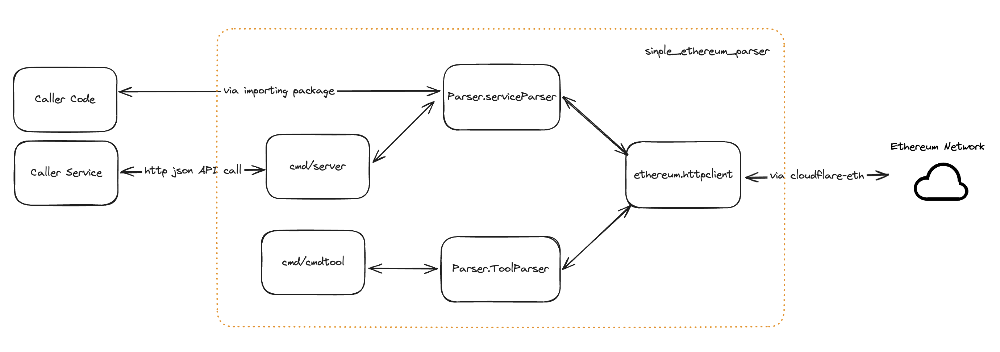

# Docs

This docs is used to record the specifications of `Simple Ethereum Parser`. The following topics are covered but not limited to:

1. The Requirements Analysis 
  * Functional Requirements 
  * Non-Functional Require
2. The Tech Designs 
  * Architecture
  * Key Designs
3. Tests
4. Deployment 
5. Runtime
6. Others

## The Requirements Analysis 

### Terminology
|Terminology|Explain|
|:-- | :-- |
| Parser | The ethereum parser which would be implemented in this project |
| Cmd tool | The command line tool which would be implemented in this project |
| API Server | The server would server the API requests, which would be implement in this project| 
| Callers | The entities (code, services .etc) which may involve the code of `Parse`, or call the API of the `API Server` |

### Functional Requirements 

According to the original requirements document, there are two parts of function requirements, the parser itself and the access part.
* The Parser which expose 3 APIs 
  There is nothing special to analyse for this part. We would implement this part via the `Ethereum JSON-RPC`, as the doc requires.

* The ways to access the Parser, which may cover **code**, **command line** and **REST API call**  
  * Access via code. **One package would be implemented**, and the caller code can access the parse via the exposed interfaces.
  * Access via command line. **A simple cmd tool would be implemented** directly, to support this requirement.
  * Access via API call. The APIs would be exposed to the callers, and an `API Server` would be implemented to serve the API call. 

### Non-Function API Requirements

* Performance
  The QPS of API `parser.GetTransactions` is 200. To achieve this, there are some key problems need to pay attention for 3 different access ways.
  * Access via code. The caller need to pay attention to the performance. Some configurations is necessary to support this. See more details in the Tech Designs part.
  * Access vis command line. Since the cmd tool is called manually, the performance is not required so strictly. For example, it's tolerable of a little higher latency to get all the transactions of an address.
  * Access via API call. Performance is required to match the QPS.

* High Availability
  For simplification, HA is not covered in the initial version of the project.  
  * Currently, we are storing data in memory, which leads the service instances stateful. To achieve the HA, we definitely need to consider data replication (hence data latency and consistency are coming afterward closely) 
  * In future, it's worth to store the data in other centralized storage component, which make the service stateless, which is more friendly to HA.

* Stability
  One potential risk of stability is the **memory usage**. It's possible to have a large number of addresses subscribed and some of them have a huge number of transactions. 

  Before the data is migrated to a robust separate storage component, it's necessary to to have some limitations on the number of subscribed addresses and the number of transactions of each address
  

* Scalability  
  This point is NOT covered in this version. 

  The services are stateful with in-memory data, hence a lot of work need to consider to scale up/down the service instances, for example, data sharding and migration need to consider when the service is scaled up or down. 

  Actually, there would be ONLY 1 instance running in the initial version.

* Extendability 
  The `parser` package is exposed as interface. It would be easy to extend different implementations, for example, an implementation which uses separated storage components. 
  

## The Tech Designs 

### Terminology
|Terminology|Explain|
|:-- | :-- |
| ServiceParser| One implementation of `Parser` interface, which would serve the `API Server` and scenario of accessing via code |
| ToolParser | One implementation of `Parser` interface, which would serve the `Cmd Tool` |

### Architecture

The over all architecture(dependencies, data flows) would be like this

There would 2 implementations of `Parser` interface, which serve different scenarios. Refer to the key design sections for more details.

### Key Designs

#### ServiceParser

The `ServiceParser` would serve the `API Server` and scenarios of accessing via code.  

##### Function

